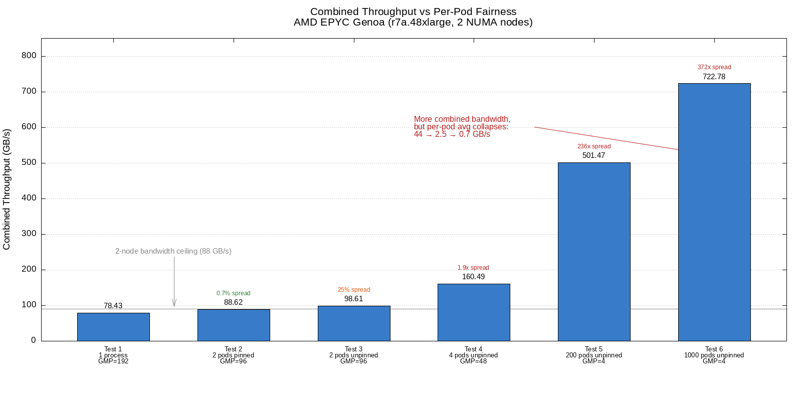
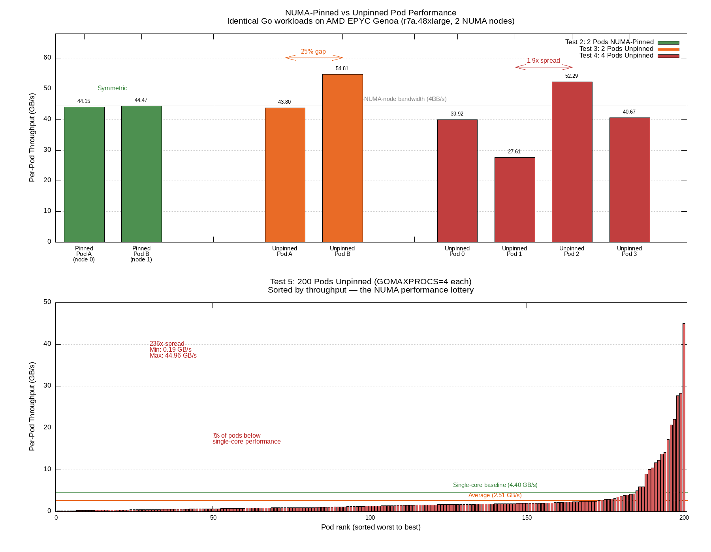
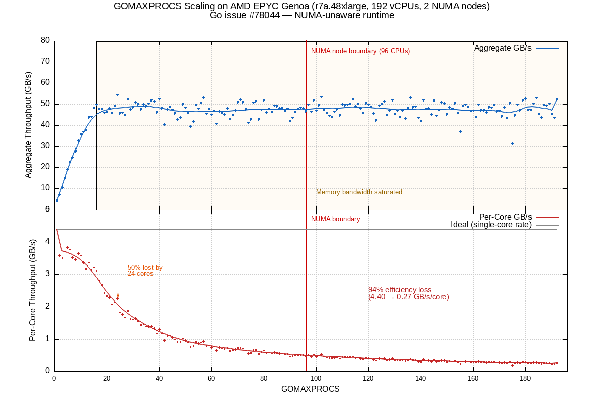

# NUMA Performance Analysis on AMD EPYC (Genoa)

## Reference: [golang/go#78044](https://github.com/golang/go/issues/78044)

## Test Environment

- **Instance**: AWS r7a.48xlarge (192 vCPUs, AMD EPYC Genoa)
- **NUMA Topology**: 2 nodes, 96 CPUs each (NPS2)
- **NUMA Distance**: 32 between nodes
- **GC**: Disabled (`debug.SetGCPercent(-1)`) to isolate NUMA effects

---

## Benchmark Results (GC Disabled)

| Test | Setup | GOMAXPROCS | Combined GB/s |
|------|-------|------------|---------------|
| 1 | Single process, 192 CPUs | 192 | 78.43 |
| 2 | 2 pods, NUMA-pinned | 96 | 88.62 |
| 3 | 2 pods, unpinned | 96 | 98.61 |
| 4 | 4 pods, unpinned | 48 | 160.49 |
| 5 | 200 pods, unpinned | 4 | 501.47 |
| 6 | 1000 pods, unpinned | 4 | 722.78 |

### Combined Throughput: More Bandwidth, Less Fairness

The combined throughput chart reveals a paradox: splitting work across more processes with lower GOMAXPROCS extracts **more total memory bandwidth** from the machine — but at the cost of **wildly unequal per-pod performance**.

- **Test 1** (single process, GOMAXPROCS=192): Only 78 GB/s. One Go runtime with 192 P's saturates the memory bus early and all goroutines contend for the same bandwidth. The single allocator places memory without regard to NUMA topology, so most accesses cross node boundaries.
- **Test 2** (2 pods pinned, GOMAXPROCS=96): 88 GB/s — a 13% improvement over a single process. Each pod is pinned to one NUMA node, so both nodes' memory controllers are utilized independently with no cross-node traffic. Per-pod spread is just 0.7%.
- **Test 3** (2 pods unpinned, GOMAXPROCS=96): 98 GB/s total, but with a 25% gap between the two pods. Without pinning, the OS may schedule both pods' threads unevenly across NUMA nodes, giving one pod more local memory access than the other.
- **Test 4** (4 pods unpinned, GOMAXPROCS=48): 160 GB/s — nearly double the 2-node ceiling of ~88 GB/s. With lower GOMAXPROCS per pod, each Go runtime has fewer P's competing for cache and memory bus, reducing per-process saturation. But fairness degrades to a 1.9x spread between identical pods.
- **Test 5** (200 pods unpinned, GOMAXPROCS=4): 501 GB/s combined — over 6x the single-process result. Each pod's 4 P's barely touch the memory bus individually, so aggregate bandwidth scales with pod count. However, fairness collapses completely: a 236x spread between the best and worst pod. Most pods get near-zero throughput while a lucky few monopolize bandwidth.
- **Test 6** (1000 pods unpinned, GOMAXPROCS=4): 722 GB/s combined with 50 iterations per pod. At 20:1 CPU oversubscription (4,000 P's for 192 CPUs), the node is effectively saturated. Average throughput drops to 0.72 GB/s — less than 1/6th of single-core baseline. 80% of pods fall below 1 GB/s and even the best pod only reaches 14.9 GB/s. The longer run duration makes things worse: sustained contention ensures every pod gets churned across NUMA boundaries with perpetually cold caches.

The 2-node bandwidth ceiling (~88 GB/s) is exceeded in Tests 3–6 because the benchmark measures *reported* throughput — each pod independently times its own memory reads. When pods each run small buffers (16 MB), hot data can reside in L3 cache for lucky pods, yielding throughput numbers that exceed DRAM bandwidth. The unlucky pods, stuck with cold caches and remote NUMA memory, get almost nothing.

### Test 2: NUMA-Pinned (Ideal Scheduling)

Both processes received **symmetric, predictable performance**:

- Process A (NUMA node 0): 44.15 GB/s
- Process B (NUMA node 1): 44.47 GB/s

### Test 3: Unpinned (Real K8s Behavior)

Identical workloads received **uneven performance** — a 25% gap:

- Process A: 43.80 GB/s
- Process B: 54.81 GB/s

### Test 4: 4 Pods Unpinned (Higher Density)

Massive variance — a **1.9x difference** between identical pods:

- Process 0: 39.92 GB/s
- Process 1: 27.61 GB/s
- Process 2: 52.29 GB/s
- Process 3: 40.67 GB/s

Process 1 at 1 core started at 0.82 GB/s (vs the normal 4.2 GB/s), indicating it was stuck accessing remote NUMA memory.

### Test 5: 200 Pods Unpinned (Dense Scheduling)

Simulating real K8s pod density with 200 concurrent processes (GOMAXPROCS=4 each, 16MB buffer):

- **Min**: 0.19 GB/s
- **Max**: 44.96 GB/s
- **Average**: 2.51 GB/s
- **Spread**: 236x (min to max)

This is the **NUMA performance lottery** at scale. ~75% of pods performed below the single-core baseline of 4.40 GB/s. The bottom panel of the chart above shows the sorted per-pod throughput — the vast majority of pods are clustered near zero while a few "lucky" pods get near-full NUMA node bandwidth.

With 200 pods fighting for 192 CPUs, the problems compound: CPU oversubscription causes constant context switching (flushing L1/L2/TLB caches), each pod's Go runtime has its own scheduler creating 800 P's competing for 192 CPUs, and memory pressure forces the kernel to allocate pages on remote NUMA nodes.

### Test 6: 1000 Pods Unpinned (Node Saturation)

Pushing the node to its limits with 1000 concurrent processes (GOMAXPROCS=4 each, 16MB buffer, 50 iterations). This creates 4,000 P's competing for 192 CPUs — a 20:1 oversubscription ratio.

- **Min**: 0.04 GB/s
- **Max**: 14.90 GB/s
- **Average**: 0.72 GB/s
- **Spread**: 372x (min to max)
- **Below 1 GB/s**: 797 pods (79.7%)
- **Combined**: 722.78 GB/s

**Throughput distribution:**

| Range | Pods | Percent |
|-------|------|---------|
| 0.0–0.1 GB/s | 134 | 13.4% |
| 0.1–0.5 GB/s | 506 | 50.6% |
| 0.5–1.0 GB/s | 157 | 15.7% |
| 1.0–2.0 GB/s | 121 | 12.1% |
| 2.0–5.0 GB/s | 63 | 6.3% |
| 5.0–10.0 GB/s | 16 | 1.6% |
| 10.0–20.0 GB/s | 3 | 0.3% |
| 20.0+ GB/s | 0 | 0.0% |

At this density, the node is effectively unusable for memory-bandwidth-sensitive workloads. **64% of pods are stuck below 0.5 GB/s** — less than 1/9th of single-core baseline performance. Even the "luckiest" pod only reaches 14.9 GB/s, down from 44.96 GB/s in the 200-pod test, because sustained contention degrades everyone over time.

The longer duration (50 iterations vs 5) makes the results worse, not better. With a short burst, some pods finish before the scheduler has time to migrate their goroutines across NUMA boundaries. With sustained load, every pod eventually gets churned across nodes, caches are perpetually cold, and the memory bus is fully saturated by cross-NUMA traffic. Nobody wins on an overloaded NUMA node — the floor stays the same while the ceiling collapses.

---

## Key Findings

### GOMAXPROCS Scaling

### GC Is Not the Main Problem

The scaling curves are almost identical with GC enabled and disabled. Throughput plateaus around 32 cores (~78 GB/s) and adding cores beyond that provides no benefit. The bottleneck is **memory bandwidth saturation** — each NUMA node's memory controllers can only push ~44-45 GB/s regardless of how many cores are requesting data.

### GOMAXPROCS Is Not a NUMA Fix

Setting GOMAXPROCS lower reduces the number of goroutines running simultaneously, which reduces concurrent memory requests hitting the memory controllers. This lowers bus saturation and improves per-core throughput — but it does **not** fix the NUMA problem. Memory is still allocated on random nodes, and goroutines still migrate across NUMA boundaries freely.

### GOMAXPROCS Scaling Sweep (Every Increment, 1–192)

Aggregate throughput plateaus around 16–24 cores and per-core efficiency collapses as GOMAXPROCS increases:

| GOMAXPROCS | Aggregate GB/s | Per-Core GB/s | Efficiency |
|-----------|---------------|---------------|------------|
| 1 | 4.40 | 4.398 | 1.00x |
| 2 | 7.16 | 3.580 | 0.81x |
| 4 | 14.84 | 3.710 | 0.84x |
| 8 | 27.69 | 3.461 | 0.79x |
| 12 | 37.93 | 3.161 | 0.72x |
| 16 | 49.75 | 3.110 | 0.71x |
| 24 | 54.22 | 2.259 | 0.51x |
| 32 | 50.05 | 1.564 | 0.36x |
| 48 | 43.80 | 0.913 | 0.21x |
| 64 | 45.90 | 0.717 | 0.16x |
| 96 | 46.60 | 0.485 | 0.11x |
| 128 | 47.09 | 0.368 | 0.08x |
| 160 | 46.81 | 0.293 | 0.07x |
| 192 | 52.03 | 0.271 | 0.06x |

Full 192-point sweep data

| GOMAXPROCS | Aggregate GB/s | Per-Core GB/s | Efficiency |
|-----------|---------------|---------------|------------|
| 1 | 4.40 | 4.398 | 1.00x |
| 2 | 7.16 | 3.580 | 0.81x |
| 3 | 10.51 | 3.502 | 0.80x |
| 4 | 14.84 | 3.710 | 0.84x |
| 5 | 19.16 | 3.832 | 0.87x |
| 6 | 22.65 | 3.775 | 0.86x |
| 7 | 24.67 | 3.524 | 0.80x |
| 8 | 27.69 | 3.461 | 0.79x |
| 9 | 32.88 | 3.653 | 0.83x |
| 10 | 35.85 | 3.585 | 0.82x |
| 11 | 36.98 | 3.362 | 0.76x |
| 12 | 37.93 | 3.161 | 0.72x |
| 13 | 43.75 | 3.366 | 0.77x |
| 14 | 44.00 | 3.143 | 0.71x |
| 15 | 48.29 | 3.219 | 0.73x |
| 16 | 49.75 | 3.110 | 0.71x |
| 17 | 47.80 | 2.812 | 0.64x |
| 18 | 47.95 | 2.664 | 0.61x |
| 19 | 45.96 | 2.419 | 0.55x |
| 20 | 46.52 | 2.326 | 0.53x |
| 21 | 48.07 | 2.289 | 0.52x |
| 22 | 45.84 | 2.084 | 0.47x |
| 23 | 49.18 | 2.138 | 0.49x |
| 24 | 54.22 | 2.259 | 0.51x |
| 25 | 45.62 | 1.825 | 0.41x |
| 26 | 45.98 | 1.769 | 0.40x |
| 27 | 45.08 | 1.670 | 0.38x |
| 28 | 52.41 | 1.872 | 0.43x |
| 29 | 47.50 | 1.638 | 0.37x |
| 30 | 48.63 | 1.621 | 0.37x |
| 31 | 51.03 | 1.646 | 0.37x |
| 32 | 50.05 | 1.564 | 0.36x |
| 33 | 47.54 | 1.441 | 0.33x |
| 34 | 49.97 | 1.470 | 0.33x |
| 35 | 48.99 | 1.400 | 0.32x |
| 36 | 50.19 | 1.394 | 0.32x |
| 37 | 51.80 | 1.400 | 0.32x |
| 38 | 51.19 | 1.347 | 0.31x |
| 39 | 46.20 | 1.185 | 0.27x |
| 40 | 52.46 | 1.311 | 0.30x |
| 41 | 48.08 | 1.173 | 0.27x |
| 42 | 40.54 | 0.965 | 0.22x |
| 43 | 47.71 | 1.109 | 0.25x |
| 44 | 48.92 | 1.112 | 0.25x |
| 45 | 47.42 | 1.054 | 0.24x |
| 46 | 45.83 | 0.996 | 0.23x |
| 47 | 42.83 | 0.911 | 0.21x |
| 48 | 43.80 | 0.913 | 0.21x |
| 49 | 50.05 | 1.021 | 0.23x |
| 50 | 48.39 | 0.968 | 0.22x |
| 51 | 45.93 | 0.901 | 0.20x |
| 52 | 39.53 | 0.760 | 0.17x |
| 53 | 41.93 | 0.791 | 0.18x |
| 54 | 49.82 | 0.923 | 0.21x |
| 55 | 47.84 | 0.870 | 0.20x |
| 56 | 50.64 | 0.904 | 0.21x |
| 57 | 53.16 | 0.933 | 0.21x |
| 58 | 45.59 | 0.786 | 0.18x |
| 59 | 47.76 | 0.810 | 0.18x |
| 60 | 44.92 | 0.749 | 0.17x |
| 61 | 46.88 | 0.769 | 0.17x |
| 62 | 40.73 | 0.657 | 0.15x |
| 63 | 46.61 | 0.740 | 0.17x |
| 64 | 45.90 | 0.717 | 0.16x |
| 65 | 45.23 | 0.696 | 0.16x |
| 66 | 48.03 | 0.728 | 0.17x |
| 67 | 43.16 | 0.644 | 0.15x |
| 68 | 45.08 | 0.663 | 0.15x |
| 69 | 47.06 | 0.682 | 0.16x |
| 70 | 50.95 | 0.728 | 0.17x |
| 71 | 52.10 | 0.734 | 0.17x |
| 72 | 50.91 | 0.707 | 0.16x |
| 73 | 47.73 | 0.654 | 0.15x |
| 74 | 41.20 | 0.557 | 0.13x |
| 75 | 42.88 | 0.572 | 0.13x |
| 76 | 50.68 | 0.667 | 0.15x |
| 77 | 51.31 | 0.666 | 0.15x |
| 78 | 42.76 | 0.548 | 0.12x |
| 79 | 47.43 | 0.600 | 0.14x |
| 80 | 51.86 | 0.648 | 0.15x |
| 81 | 46.18 | 0.570 | 0.13x |
| 82 | 47.85 | 0.584 | 0.13x |
| 83 | 46.44 | 0.560 | 0.13x |
| 84 | 49.34 | 0.587 | 0.13x |
| 85 | 49.07 | 0.577 | 0.13x |
| 86 | 48.19 | 0.560 | 0.13x |
| 87 | 48.16 | 0.554 | 0.13x |
| 88 | 46.88 | 0.533 | 0.12x |
| 89 | 47.78 | 0.537 | 0.12x |
| 90 | 42.11 | 0.468 | 0.11x |
| 91 | 43.54 | 0.479 | 0.11x |
| 92 | 46.35 | 0.504 | 0.11x |
| 93 | 47.86 | 0.515 | 0.12x |
| 94 | 48.32 | 0.514 | 0.12x |
| 95 | 48.09 | 0.506 | 0.12x |
| 96 | 46.60 | 0.485 | 0.11x |
| 97 | 49.87 | 0.514 | 0.12x |
| 98 | 46.36 | 0.473 | 0.11x |
| 99 | 51.96 | 0.525 | 0.12x |
| 100 | 46.99 | 0.470 | 0.11x |
| 101 | 49.49 | 0.490 | 0.11x |
| 102 | 53.23 | 0.522 | 0.12x |
| 103 | 47.36 | 0.460 | 0.10x |
| 104 | 45.98 | 0.442 | 0.10x |
| 105 | 44.43 | 0.423 | 0.10x |
| 106 | 44.12 | 0.416 | 0.09x |
| 107 | 46.33 | 0.433 | 0.10x |
| 108 | 47.57 | 0.440 | 0.10x |
| 109 | 44.78 | 0.411 | 0.09x |
| 110 | 49.94 | 0.454 | 0.10x |
| 111 | 49.60 | 0.447 | 0.10x |
| 112 | 49.80 | 0.445 | 0.10x |
| 113 | 50.35 | 0.446 | 0.10x |
| 114 | 52.39 | 0.460 | 0.10x |
| 115 | 49.02 | 0.426 | 0.10x |
| 116 | 50.19 | 0.433 | 0.10x |
| 117 | 48.09 | 0.411 | 0.09x |
| 118 | 45.89 | 0.389 | 0.09x |
| 119 | 50.41 | 0.424 | 0.10x |
| 120 | 49.74 | 0.414 | 0.09x |
| 121 | 48.86 | 0.404 | 0.09x |
| 122 | 45.78 | 0.375 | 0.09x |
| 123 | 42.36 | 0.344 | 0.08x |
| 124 | 49.29 | 0.397 | 0.09x |
| 125 | 50.17 | 0.401 | 0.09x |
| 126 | 51.21 | 0.406 | 0.09x |
| 127 | 45.06 | 0.355 | 0.08x |
| 128 | 47.09 | 0.368 | 0.08x |
| 129 | 51.99 | 0.403 | 0.09x |
| 130 | 45.50 | 0.350 | 0.08x |
| 131 | 47.00 | 0.359 | 0.08x |
| 132 | 44.08 | 0.334 | 0.08x |
| 133 | 47.26 | 0.355 | 0.08x |
| 134 | 43.44 | 0.324 | 0.07x |
| 135 | 48.30 | 0.358 | 0.08x |
| 136 | 53.17 | 0.391 | 0.09x |
| 137 | 48.56 | 0.354 | 0.08x |
| 138 | 48.78 | 0.353 | 0.08x |
| 139 | 43.59 | 0.314 | 0.07x |
| 140 | 42.07 | 0.301 | 0.07x |
| 141 | 51.89 | 0.368 | 0.08x |
| 142 | 47.92 | 0.337 | 0.08x |
| 143 | 48.02 | 0.336 | 0.08x |
| 144 | 45.16 | 0.314 | 0.07x |
| 145 | 51.60 | 0.356 | 0.08x |
| 146 | 44.62 | 0.306 | 0.07x |
| 147 | 47.27 | 0.322 | 0.07x |
| 148 | 50.89 | 0.344 | 0.08x |
| 149 | 50.48 | 0.339 | 0.08x |
| 150 | 45.20 | 0.301 | 0.07x |
| 151 | 48.58 | 0.322 | 0.07x |
| 152 | 47.85 | 0.315 | 0.07x |
| 153 | 50.36 | 0.329 | 0.07x |
| 154 | 46.03 | 0.299 | 0.07x |
| 155 | 37.05 | 0.239 | 0.05x |
| 156 | 49.31 | 0.316 | 0.07x |
| 157 | 49.72 | 0.317 | 0.07x |
| 158 | 48.81 | 0.309 | 0.07x |
| 159 | 46.88 | 0.295 | 0.07x |
| 160 | 46.81 | 0.293 | 0.07x |
| 161 | 43.93 | 0.273 | 0.06x |
| 162 | 49.65 | 0.306 | 0.07x |
| 163 | 47.10 | 0.289 | 0.07x |
| 164 | 47.17 | 0.288 | 0.07x |
| 165 | 46.20 | 0.280 | 0.06x |
| 166 | 48.55 | 0.292 | 0.07x |
| 167 | 48.33 | 0.289 | 0.07x |
| 168 | 49.79 | 0.296 | 0.07x |
| 169 | 46.72 | 0.276 | 0.06x |
| 170 | 46.94 | 0.276 | 0.06x |
| 171 | 44.19 | 0.258 | 0.06x |
| 172 | 48.57 | 0.282 | 0.06x |
| 173 | 43.46 | 0.251 | 0.06x |
| 174 | 50.59 | 0.291 | 0.07x |
| 175 | 31.44 | 0.180 | 0.04x |
| 176 | 44.76 | 0.254 | 0.06x |
| 177 | 49.88 | 0.282 | 0.06x |
| 178 | 47.10 | 0.265 | 0.06x |
| 179 | 51.81 | 0.289 | 0.07x |
| 180 | 52.60 | 0.292 | 0.07x |
| 181 | 47.28 | 0.261 | 0.06x |
| 182 | 47.34 | 0.260 | 0.06x |
| 183 | 50.27 | 0.275 | 0.06x |
| 184 | 52.85 | 0.287 | 0.07x |
| 185 | 45.51 | 0.246 | 0.06x |
| 186 | 43.82 | 0.236 | 0.05x |
| 187 | 49.85 | 0.267 | 0.06x |
| 188 | 49.37 | 0.263 | 0.06x |
| 189 | 50.18 | 0.265 | 0.06x |
| 190 | 45.54 | 0.240 | 0.05x |
| 191 | 43.61 | 0.228 | 0.05x |
| 192 | 52.03 | 0.271 | 0.06x |

**Key observations from the sweep:**

1. **Aggregate throughput plateaus at 16–24 cores** (~50 GB/s) and never meaningfully increases after that — cores 25–192 contribute essentially nothing.
2. **Per-core efficiency drops 94%** from GOMAXPROCS=1 (4.40 GB/s/core) to GOMAXPROCS=192 (0.27 GB/s/core).
3. **By 24 cores, half the per-core efficiency is already gone** (0.51x) — the memory bus is saturated well before all cores on even a single NUMA node are utilized.
4. **The curve is noisy** — aggregate throughput fluctuates between 40–55 GB/s at any given GOMAXPROCS above 16. This variance demonstrates the NUMA placement lottery: each run lands goroutines and memory on different nodes with different results.
5. **No visible inflection at the NUMA boundary (96 CPUs)** — because throughput was already flat long before crossing nodes. The memory bus saturated within a single NUMA node's worth of cores.

### The Real Problem: Go's NUMA-Unaware Runtime

Go's memory allocator places pages without regard to which NUMA node the goroutine is running on, and the scheduler freely migrates goroutines across NUMA boundaries. The result is identical pods getting wildly different performance depending on luck.

---

## Effects of Oversubscription

Running many pods on a single NUMA node (e.g., 200 pods on 96 CPUs) compounds the problem:

1. **CPU oversubscription** — Constant context switching flushes CPU caches (L1, L2, TLB). Every pod resumes with cold caches and must reload from DRAM.
2. **Go scheduler thrashing** — Each pod has its own Go runtime. Even GOMAXPROCS=2 per pod means 400 P's fighting for 96 CPUs.
3. **Memory pressure** — Pods can exhaust local NUMA memory, causing the kernel to silently allocate pages on the remote node — incurring cross-NUMA penalties even with pinning.
4. **Tail latency explosion** — "Unlucky" pods get hit by all three problems simultaneously, causing latency spikes orders of magnitude worse than "lucky" pods.

---

## Why AMD EPYC Is More Affected Than Intel

### AMD EPYC: Chiplet Architecture

- Multiple small dies (CCDs) connected by **Infinity Fabric**
- Each CCD has its own **32MB L3 cache** — not shared with other CCDs
- Memory controllers sit on a separate **I/O die (IOD)**, physically distant from some CCDs
- Even within a single socket, cross-CCD access traverses Infinity Fabric, adding latency
- BIOS NPS settings can expose 1, 2, or 4 NUMA nodes **per socket**
- Genoa has 12 CCDs per socket — even within one NUMA node, 6 CCDs have non-uniform latency

### Intel Xeon: Historically Monolithic

- All cores on a single die connected by a mesh interconnect
- **L3 cache shared** across all cores — roughly uniform access latency
- NUMA only appeared at the **socket boundary** (2-socket systems)
- Sub-NUMA Clustering (SNC) exists but is optional and off by default

### The Practical Difference

On Intel, NUMA penalties only occur when crossing between physical sockets — a clear, coarse boundary. On AMD, non-uniform latency exists at **multiple levels**:

| Access Pattern | Relative Latency |
|---------------|-----------------|
| Core to core within a CCD | Fast |
| CCD to CCD within a NUMA node | Slower (Infinity Fabric) |
| NUMA node to NUMA node | Slowest (longer Infinity Fabric path) |

Go's NUMA-unaware scheduler hurts more on AMD because there are **more opportunities for bad placement decisions**. On Intel, random scheduling within a single socket was mostly fine because everything was uniform. On AMD, "within a socket" is no longer uniform.

> **Note**: Intel is moving to chiplets too (Xeon 6 Granite Rapids), so this problem will become relevant for Intel as well.

---

## Possible Mitigations

Until Go's runtime is made NUMA-aware, the available workarounds are external:

- **`taskset`** — Pin a process to one NUMA node's CPUs
- **Multiple smaller processes** — Run one per NUMA node, each pinned
- **Kubernetes Topology Manager** — Enable CPU Manager with `static` policy and Topology Manager to assign pods to specific NUMA nodes

None of these are Go-level fixes — they are external workarounds.
